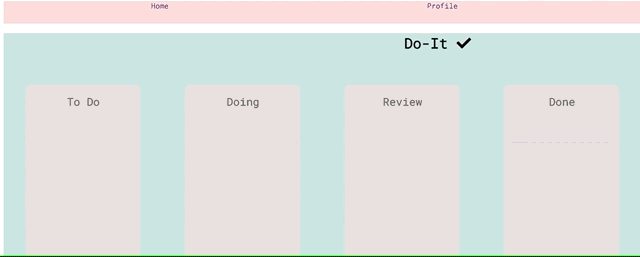

# Kanban App

This app is more than a simple to-do app. Users can create to-do items and change the status either by using the dropdown or by dragging them to other columns. 

# Technologies used: 
-Javascript (ES6)
-SCSS
-React
-NodeJs
-Express
-Mongo DB
-Mongoose
-Mocha and Chai

# Example

